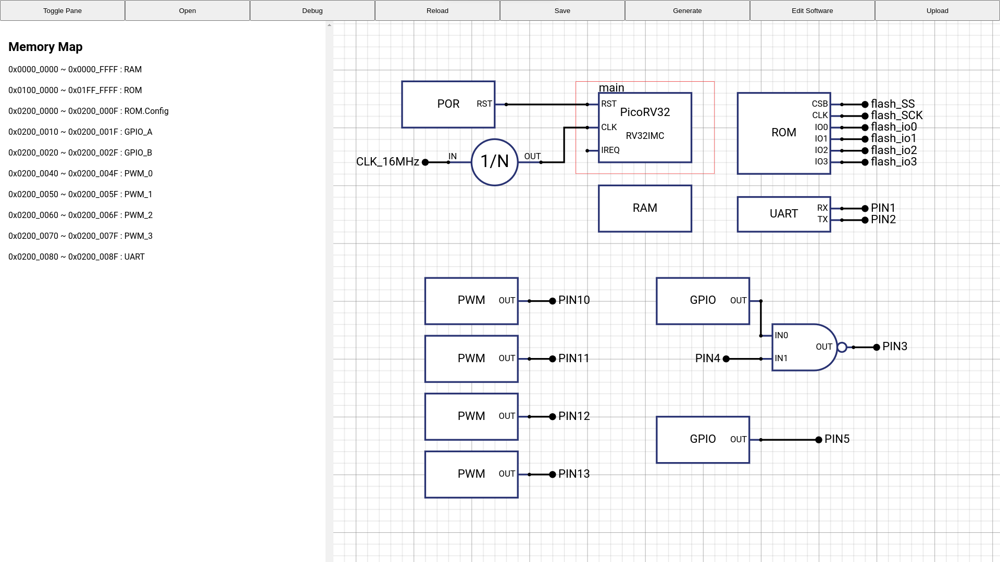

# Next-MICON <!-- omit in toc -->



※ は将来実装予定の機能です。

Arduinoを使っていて、並行して処理がしたい！高速な処理がしたい！通信ポートが足りない！と思ったことはありませんか？
Next-MICONを使えば、レゴブロックみたいに、部品を組み合わせるだけで、マイコンを作れちゃいます。
さらに、自作したマイコン向けのライブラリやコンパイラも自動で生成されます！Next-MICONを使って自分だけのマイコンを作ってみませんか？

- [概要](#概要)
- [1. GUIエディタによる開発](#1-guiエディタによる開発)
  - [1.1. 環境構築](#11-環境構築)
  - [1.2. プロジェクトの初期化](#12-プロジェクトの初期化)
  - [1.3. マイコンの編集](#13-マイコンの編集)
    - [1.3.1. インスタンスの追加](#131-インスタンスの追加)
    - [1.3.2. 配線](#132-配線)
- [2. CLIによる開発](#2-cliによる開発)
  - [2.1. プロジェクトの初期化](#21-プロジェクトの初期化)
  - [2.2. ターゲットパッケージのインストール](#22-ターゲットパッケージのインストール)
  - [2.3. 依存パッケージをインストール](#23-依存パッケージをインストール)
    - [2.3.1. パッケージ情報の更新](#231-パッケージ情報の更新)
    - [2.3.2. ※ パッケージの追加](#232--パッケージの追加)
    - [2.3.3. インストール](#233-インストール)
  - [2.4. ハードウェアを編集](#24-ハードウェアを編集)
    - [2.4.1. テキストエディタで編集](#241-テキストエディタで編集)
    - [2.4.2. ※ GUI で編集](#242--gui-で編集)
  - [2.5. ビルド](#25-ビルド)
  - [2.6. ソフトウェアを編集](#26-ソフトウェアを編集)
  - [2.7. ハードウェアの変更](#27-ハードウェアの変更)
    - [2.7.1. ※ モジュールのリネーム](#271--モジュールのリネーム)
  - [2.8. 書き込み](#28-書き込み)
- [3. ハードウェアの書き方](#3-ハードウェアの書き方)
  - [3.1. インスタンス](#31-インスタンス)
    - [3.1.1. Verilog](#311-verilog)
  - [3.2. アドレス空間](#32-アドレス空間)
    - [3.2.1. Verilog](#321-verilog)
    - [3.2.2. アドレス空間に接続可能なパッケージの要件](#322-アドレス空間に接続可能なパッケージの要件)
    - [3.2.3. メモ](#323-メモ)
- [4. パッケージの自作](#4-パッケージの自作)
  - [4.1. クラス](#41-クラス)
- [5. 機能](#5-機能)
- [6. FPGAツール](#6-fpgaツール)
  - [6.1. Yosys](#61-yosys)
  - [6.2. nextpnr](#62-nextpnr)
  - [6.3. tinyprog](#63-tinyprog)
- [7. ポリシー](#7-ポリシー)
- [8. Commit](#8-commit)
  - [8.1. boost のインストール](#81-boost-のインストール)
  - [8.2. yaml-cpp のインストール](#82-yaml-cpp-のインストール)
- [9. 実装予定の機能](#9-実装予定の機能)
- [10. トランスパイラの動作](#10-トランスパイラの動作)
  - [10.1. プロジェクトの読み込み](#101-プロジェクトの読み込み)
  - [10.2. パッケージの読み込み](#102-パッケージの読み込み)
  - [10.3. ハードウェアの読み込み](#103-ハードウェアの読み込み)
    - [10.3.1. ターゲット](#1031-ターゲット)
    - [10.3.2. モジュール](#1032-モジュール)
      - [10.3.2.1. パッケージの解決](#10321-パッケージの解決)
      - [10.3.2.2. パラメタの解決](#10322-パラメタの解決)
    - [10.3.3. 配線](#1033-配線)
      - [10.3.3.1. モジュールの解決](#10331-モジュールの解決)
      - [10.3.3.2. ピンの解決](#10332-ピンの解決)
      - [10.3.3.3. 型の解決](#10333-型の解決)
    - [10.3.4. メモリマップ](#1034-メモリマップ)
      - [10.3.4.1. メモリマップの接続方法](#10341-メモリマップの接続方法)
      - [10.3.4.2. CS信号の生成](#10342-cs信号の生成)
      - [10.3.4.3. Addr信号](#10343-addr信号)
  - [10.4. メモ](#104-メモ)
    - [10.4.1. 環境構築](#1041-環境構築)
    - [10.4.2. IPC API の追加方法](#1042-ipc-api-の追加方法)
    - [10.4.3. Undo/Redoの実装](#1043-undoredoの実装)
    - [10.4.4. Milestone](#1044-milestone)
    - [10.4.5. Future](#1045-future)
    - [10.4.6. セキュリティホール](#1046-セキュリティホール)
    - [10.4.7. コミットメッセージ](#1047-コミットメッセージ)
    - [10.4.8. Wireのデータ構造](#1048-wireのデータ構造)
    - [10.4.9. Hardwareファイルの構成](#1049-hardwareファイルの構成)

# 概要


# 1. GUIエディタによる開発

## 1.1. 環境構築

GitHubReleaseにあるインストーラをダウンロードしインストールします。

## 1.2. プロジェクトの初期化

アプリを立ち上げたら、スタート画面が現れます。

ここで、新規プロジェクト→サンプルを選択してください。

## 1.3. マイコンの編集

GUI画面が開きました。ここでマイコン構成ファイルを編集します。

### 1.3.1. インスタンスの追加

何もない部分を右クリックすると、パッケージ検索画面が立ち上がります。

パッケージをクリックすると、詳細が見れます。

パッケージをダブルクリックすると、エディタ上にアイコンが現れます。クリックしてインスタンスを追加します。ESCでインスタンスの追加を終了します。

インスタンスを右クリックすると、

### 1.3.2. 配線

インスタンスのピンを

# 2. CLIによる開発

CLIで開発することもできます。jsonをいじってもいいのですが、人間が手書きするには向いていないので、専用の形式で書けます。

## 2.1. プロジェクトの初期化

```
~$ mkdir my-nm-project
~$ cd my-nm-project
~/my-nm-project$ nm init
```

`nm init` でプロジェクトを初期化すると、以下のフォルダが生成されます。

```
project
|- project.json  : プロジェクト全体に関する情報
|- packages      : ここに依存パッケージをインストール
|- hardware.json : マイコンの構成を記述したファイル
|- software      : マイコンで動かすプログラム
|  |- main.cpp
|- build         : 自動生成されたファイル置き場
|  |- hardware
|  |- software

|- .gitignore
|- README.md
|- .clang-format
|- .vscode
    |- extensions.json
    |- c_cpp_properties.json
    |- setting.json
    |- launch.json
```

> VSCodeで開発における開発を楽にするための設定ファイルを自動生成しますが、宗教戦争をしたいわけではありません。
> 
> `nm init --min` とすれば、設定ファイルを除いた最小構成でプロジェクトを初期化します。

## 2.2. ターゲットパッケージのインストール

使用するFPGAボードに必要なファイルをプロジェクトに追加します。

```
$ nm add TinyFPGA_BX
$ nm target TinyFPGA_BX
```

各FPGAボードの対応状況は [FPGAボードの対応状況](doc/Target.md) をご確認ください。

> `hardware.json > target` に書き込まれます。
> 
> ```json:hardware.json
> {
>   "target":"TinyFPGA_BX"
> }
> ```

## 2.3. 依存パッケージをインストール

プロジェクトで使用するパッケージを追加しましょう。`project.json`の`packages`に、プロジェクトが依存しているパッケージの一覧があります。

それぞれ、パッケージの名前、リポジトリの場所、ローカルにおける場所が書かれています。

```json:
{
  "packages":[
    {
      "name": "NAND",
      "repo": "https://raw.githubusercontent.com/Next-MICON/basic-packages/main/NAND/",
      "path": "packages/NAND/"
    }
  ]
}
```

### 2.3.1. パッケージ情報の更新

パッケージの一覧表を更新します。

`nm update`

> NMパッケージは、パッケージの作者がそれぞれのGitHubリポジトリで公開します。
> NMパッケージ・サーバは、リポジトリ・テーブル（パッケージ名とリポジトリのURLの対応表）を公開している、掲示板のようなものです。
> リポジトリ・テーブルは、`~.Next-MICON/repo-info/` 以下にあります。
> 
> `nm update` はこの対応表を更新します。

### 2.3.2. ※ パッケージの追加

`nm add [package name]`

パッケージ名を指定して追加できます。

> パッケージサーバは、パッケージ名を解決して、リポジトリのURLを返します。
> パッケージマネージャは、ローカルにキャッシュを持っています。
> 場所は `~.Next-MICON/global_package/` にあります。


パッケージサーバに、パッケージ名を投げると、リポジトリのURLを返してきます。

`nm add --repo [repo]`

必要なファイルをダウンロードしてきます。

`nm add --local [package path]`

自作したパッケージなど、ローカルにあるパッケージをインストールする場合、`--local` オプションをつけます。

### 2.3.3. インストール

Gitからプロジェクトをcloneした場合など、

`project.json`の`packages`に、

> \aside{パッケージマネージャの動作}
>
> `nm install` をすると、パッケージマネージャは `packages[]` の中身を読んでロードします。
> 
> パッケージマネージャは、ローカルにキャッシュを持っています。
> 場所は `~.Next-MICON/global_package/` にあります。

## 2.4. ハードウェアを編集

`hardware.yaml` に、マイコンの構成を記述します。

### 2.4.1. テキストエディタで編集

### 2.4.2. ※ GUI で編集

`nm gui` でGUIエディタを起動できます。

## 2.5. ビルド

`nm build`

ハードウェア構成ファイル (`hardware.json`) をもとに、

- `hardware.v`
- `firmware.hpp`
- `main.lds`
- `Mkaefile`

を生成します。

`make upload` で、書き込みができるようになります。

## 2.6. ソフトウェアを編集

`./software/main.cpp`

ハードウェアのモジュールに対応するクラスのインスタンスが、`firmware.hpp` に生成されています。

```
PackageName module_name <parameter,,,> ( mem_address );
```

インスタンスのパラメタはジェネリクスに対応します。

## 2.7. ハードウェアの変更

ソフトウェアを書いていて、ハードウェアを変更したくなったら、いつでも変更できます。

基本的に、`hardware.yaml`を編集して、`nm build`し、`C++`のエラーに従って修正すれば大丈夫です。

また、以下のコマンドを使えば、ハードウェアとソフトウェアの依存関係を崩さずに変更することができます。

### 2.7.1. ※ モジュールのリネーム

`nm rename xxx yyy`

プロジェクト中のインスタンス `xxx` を `yyy` にリネームします。

## 2.8. 書き込み

FPGAを接続して、

`make upload`

すれば書き込まれます。

# 3. ハードウェアの書き方

## 3.1. インスタンス

```yaml:
module:
 - module_name: PackageName
   parameter:
    - param1: 1
    - param2: Void
```

```
# module
<name> = <package> ( <param> = <value> , , , )
```

モジュールを定義します。

### 3.1.1. Verilog

モジュール定義は、以下の Verilog に展開されます。

```verilog:
module PackageName #( 
  param1 = 1,
  param2 = 0
) module_name (
  // Connections
)
```

## 3.2. アドレス空間

```yaml:
address:
  - master_module.master_port:
    - slave_module.slave_port: [begin_addr, end_addr]
      option: [abs]
```

```
# address
master_module.master_port
 - begin_addr ~ end_addr => module.port
```

アドレス空間にモジュールを配置します。

アドレス空間の　`[begin_addr : end_addr]` をモジュールに割り当てます。

オプションとして、

次に、モジュールのポートのアドレス入力を矢印で指定します。
`->` の場合、アドレスは 0 始まりにオフセットされます。
`=>` の場合、アドレスはそのまま渡されます。

最後に、モジュールのポートを指定します。
ポート名を省略した場合、`port` が補完されます。

### 3.2.1. Verilog

アドレス空間の定義は、以下の Veilog に展開されます。

```verilog:
wire        <addr_name>_clk;   // クロック信号
wire [31:0] <addr_name>_addr;  // アドレス
wire [31:0] <addr_name>_wdata; // MOSI
wire [31:0] <addr_name>_rdata; // MISO

module <package> #( <param> = <value> , , , ) <master_module> (
  .<master_port>_clk   ( <addr_name>_ckl ),
  .<master_port>_addr  ( <addr_name>_addr ),
  .<master_port>_wdata ( <addr_name>_wdata ),
  .<master_port>_rdata ( <addr_name>_rdata ),
  // Other Connections
);

wire [3:0] <addr_name>_<guest_module>_en   =
// If Memory Map is Allinged

// if Allocation Operater is
// '=>'
wire <addr_name>_<guest_module>_addr = <addr_name>_addr;
// '->'
wire <addr_name>_<guest_module>_addr = <addr_name>_addr - <guest_begin_addr>;
// if Memory Map is Allinged
wire <addr_name>_<guest_module>_addr = { <32-n>'b0, <addr_name>_addr[<n>:0] };

module <package> #( <param> = <value> , , , ) <guest_module> (
  .<guest_port>_clk   ( <addr_name>_ckl ),
  .<guest_port>_en    ( <addr_name>_addr ),
  .<guest_port>_addr  ( <addr_name>_addr ),
  .<guest_port>_wdata ( <addr_name>_wdata ),
  .<guest_port>_rdata ( <addr_name>_rdata ),
  // Other Connections
);
```

`<addr_name>` はアドレス空間の名前で、`<master_module>_<master_port>` と一致します。

メモリ空間に接続された各モジュールごとに、アドレス信号・エネーブル信号を生成します。

その際、メモリ空間がビット整列である（上位 n ビルドを見ることで、Enable 信号が決められる）場合、ハードウェアを節約できます。可能な限りビット整列するようにしてください。


### 3.2.2. アドレス空間に接続可能なパッケージの要件

`master_module` には、以下のピンが必要です。

| io     | name                | width |
| ------ | ------------------- | ----- |
| output | `<port_name>_clk`   | 1     |
| output | `<port_name>_addr`  | 32    |
| output | `<port_name>_wdata` | 32    |
| input  | `<port_name>_rdata` | 32    |

`slave_module` には、以下のピンが必要です。

| io     | name                | width |
| ------ | ------------------- | ----- |
| input  | `<port_name>_clk`   | 1     |
| input  | `<port_name>_en`    | 4     |
| input  | `<port_name>_addr`  | 32    |
| input  | `<port_name>_wdata` | 32    |
| output | `<port_name>_rdata` | 32    |

### 3.2.3. メモ

- アドレス空間は、
  - CPU とペリフェラルのインターフェイス
  - アドレスによって切り替わるワイヤ
- ホストモジュール（アドレスのデータにアクセスし読み書きできるモジュール）がただひとつ存在する
- アドレスに関して、module を区 k ラ
- module の分類
  - アドレス空間に割り当て可能か
    - モジュールは interface address の端子を複数持つことができる
    - ↑ を持つ場合，アドレス空間に割り当てることができる
  - アドレス空間をホストするか
    - モジュールは interface addresser の端子を複数持つことができる
    - ↑ を持つ場合，アドレス空間のホストになることができる
  - 特定のハードウェア依存であるか
    - ハードウェアごとに Verilog 以外に必要なファイルが出てくる
    - いまのところ TangPrimer に対応するのみなので， TangPrimer 用の Config.json を出力する
    - ハードウェアによる制約（個数制限など）

# 4. パッケージの自作

## 4.1. クラス

| `class:`   | 意味             | 使用するファイル     |
| ---------- | ---------------- | -------------------- |
|            | 通常のパッケージ | `verilog` `firmware` |
| `hardware` | ハードウェアのみ | `verilog`            |
| `software` | ソフトウェアのみ | `firmware`           |
| `target`   | ターゲット       | `pcf` `build_cmd`    |

```
metadata: 
```

---


# 5. 機能

インクリメンタルな開発をサポートします。

# 6. FPGAツール

このプロジェクトでは、iCE40 FPGA のオープンソースツールチェーンを利用しています。

## 6.1. Yosys

`synth_ice40` でice40向けのネットリストを生成します。

[マニュアル](https://yosyshq.readthedocs.io/projects/yosys/en/latest/cmd/synth_ice40.html)

```
$ yosys -ql hardware.log -p 'synth_ice40 -top hardware -blif hardware.blif' hardware.v
```

Technology Mapper によって、デバイスのライブラリに割り当てるみたい。

## 6.2. nextpnr

[Yosys+nextpnr: an Open Source Framework from Verilog to Bitstream for Commercial FPGAs - arXiv](https://arxiv.org/abs/1903.10407)

## 6.3. tinyprog

---

# 7. ポリシー

> デフォルトの構成に従った場合何も書かなくて良いが、「全て」のデフォルト値を上書きできる

これをポリシーとしておけば、初心者にも熟練者にも使ってもらえるはず。

> 同じ情報を、複数の編集可能な場所に書かない

依存関係が複雑になり、共同開発がたいへんになる。

# 8. Commit

このプロジェクトは全てC++でできています。

## 8.1. boost のインストール

```
sudo apt install libboost-dev
```

## 8.2. yaml-cpp のインストール

```
git clone ~~~
cd yaml-cpp
mkdir build
cd build
cmake ..
make
sudo make install
```

# 9. 実装予定の機能

- デュアルCPU
- SystemVerilog
- optimize memmap
  - メモリマップを最適化します。
  - 二分木上で、各モジュールのノード数が少なくなるように、ネストが浅くなるようにすることで、メモリバスを最小のマルチプレクサで構築します。


# 10. トランスパイラの動作

## 10.1. プロジェクトの読み込み

`project.json` から、プロジェクトに含まれるファイルのパスを読み込みます。指定されていない場合、デフォルト値がロードされます。

ファイル読み込み時にデフォルト値が補完されます。

| key      | default                                                                   |
| -------- | ------------------------------------------------------------------------- |
| name     | プロジェクトのディレクトリ名 `std::filesystem::current_path().filename()` |
| board    | 標準ボード `TinyFPGA_BX`                                                  |
| hardware | `hardware.yaml`                                                           |
| software | `software`                                                                |
| firmware | `software/firmware.cpp`                                                   |
| package  | `package/[package name]`                                                  |

## 10.2. パッケージの読み込み

`project.yaml > packages:` を読み取りながら、以下のテーブルを構築します。

| パッケージ名 | 順番 | 場所             | 実体        |
| ------------ | ---- | ---------------- | ----------- |
| `HOGE`       | 1    | `./package/HOGE` | `(Package)` |
| `FUGA`       | 0    | `../FUGA`        | `(Package)` |

パッケージ名を key とした map です。

順番は、`.yaml` に書かれている順番で、出力するときは見やすいように sort します。

## 10.3. ハードウェアの読み込み

### 10.3.1. ターゲット

`hardware.yaml > target` を読み取ります。

### 10.3.2. モジュール

`hardware.yaml > module[]` を読み取りながら、以下のテーブルを構築します。

`modules`

| モジュール名 | 順番 | パッケージ   | パラメタ         |
| ------------ | ---- | ------------ | ---------------- |
| `hoge`       | 1    | `(Package*)` | `(vec<str,int>)` |


#### 10.3.2.1. パッケージの解決

パッケージを検索し、ポインタを張る。

Error：パッケージが見つからない場合 `Undefined package`

#### 10.3.2.2. パラメタの解決

まず、パッケージに含まれるパラメタ一覧 `package.parameters : vec(str,vec(str))` を取得しイテレートします。

`hardware.yaml > module[] > parameter[]` からパラメタを探し、バリデータ `valid(vec(str))(str)` を通します。このとき、パラメタが見つからなければデフォルト値 `valid.default` を返します。

Alert：`hardware.yaml > module[] > parameter[]` に `package.parameters` にないものを発見した場合 `Undefined Parameter`

### 10.3.3. 配線

`hardware.yaml > wire` を読み取りながら、以下のテーブルを構築します。

| origin_module | origin_pin | dist_module | dist_pin | width |
| ------------- | ---------- | ----------- | -------- | ----- |
| `Module*`     | `Pin*`     | `Module*`   | `Pin*`   | `int` |

#### 10.3.3.1. モジュールの解決

`modules` から、 `wire.origin.module` と `wire.dist.module` を検索し、ポインタを張る。

Error：モジュールが見つからない場合 `Undefined Module`

#### 10.3.3.2. ピンの解決

`origin_module->pin` から、`wire.origin.pin` を検索し、ポインタを張ります。

Error：ピンが見つからない場合 `Undefined Pin`

#### 10.3.3.3. 型の解決

入出力が合っているか確認
- `origin_pin.io` が `output` または `inout` か？
- `dist_pin.io` が `input` または `inout` か？
- Error：`Pin IO`
ビット幅が合っているか確認
- `origin_pin.size == dist_pin.size` か？
- Error: `Pin Width`
ビット幅を `width` に書き込む。

### 10.3.4. メモリマップ

`hardwre.yaml > memmap` を読み取りながら、以下のテーブルを構築します。

| master_module | master_port | slave_module | slave_port | addr_begin | addr_end |
| ------------- | ----------- | ------------ | ---------- | ---------- | -------- |
| `Module*`     | `Port*`     | `Module*`    | `Port*`    | `int`      | `int`    |

#### 10.3.4.1. メモリマップの接続方法

port_enable
port0_addr
port0_out
port0_in

#### 10.3.4.2. CS信号の生成

#### 10.3.4.3. Addr信号

## 10.4. メモ

### 10.4.1. 環境構築

https://zenn.dev/sprout2000/articles/5d7b350c2e85bc

### 10.4.2. IPC API の追加方法

https://zenn.dev/rakim_stayfresh/articles/2928ac74a153a5

1. `ipckey.ts` に API の string を登録
2. `global.d.ts` に API の型を登録
3. `preload.ts` で API をメインコンテキストからレンダラコンテキストに渡す
4. `main.ts` で API の本体を実装

### 10.4.3. Undo/Redoの実装

https://en.wikipedia.org/wiki/Undo

### 10.4.4. Milestone

1. 表示

プロジェクトの表示部分を完成させる。

2. 選択レイヤの設定

表示のある部分をクリックしたときに、どのオブジェクトのイベントが発火するかを設定する。

3. まとめて選択

### 10.4.5. Future

今実装するには優先度が低いが将来実装したい機能

- ファイル変更監視
  - プロジェクトのjsonファイルはIDEを通じて編集するのを前提としているが、手で編集したいときもあるかも
  - ファイルに変更があったときに、IDE上のプロジェクトをリロードする
- ディレクトリ構成の自在化
  - プロジェクトのディレクトリ構成は固定だが、これを書き換えられるようにする
  - ただ、設定ファイルの項目を増やさないようにする
  - 特に、ローカルパッケージ（自分で作製したパッケージ）を特定のディレクトリに置いておきたい場合など

### 10.4.6. セキュリティホール

- SVGのインジェクション
  - サニタイザをいれる
- Makefileで任意コマンド実行

### 10.4.7. コミットメッセージ

✅：エラーなしで動作する状態です

save：ただ保存しただけです

### 10.4.8. Wireのデータ構造

- 経由点形式
  - `Point[]`

### 10.4.9. Hardwareファイルの構成

- ターゲット
  - ターゲットとなるボードの
