# リレーコンピュータ

コンピュータといえば半導体という印象が強いですが，実はトランジスタが登場する数十年前からコンピュータは存在していました．リレーコンピュータもそんな前半導体時代のコンピュータのひとつです．

## リレーとは？

電磁石で動くスイッチです．[^1]

[^1]: 論理回路の素子として必要な性質は「電気で制御可能なスイッチ」であることです．

## しくみ

### 1. クロックジェネレータ

電源を入れると，まずクロックジェネレータが動きだし，クロック信号を生成します．

コンデンサが充放電を繰り返しながらリレーが発振します．

### 2. プログラムカウンタ

クロック信号のパルスが来るごとに，カウントアップします．

### 3. プログラムメモリ

カウンタに対応した番地の命令を取り出します．

### 4. 命令の実行

命令の内容に応じていろいろな動作をします．

このコンピュータには３種類の命令があります．

1. JumpIf
2. Move
3. Load

### 5. そして次の命令へ

## プログラムの例

## CPU 入門

### 1. 計算とはすごろくである

例えば 3 × 2 という計算を考えてみましょう．

最後に持っている大福の数が 3 × 2 の答えになっています．[^2]

[^2]: なぜこんなにまわりくどい方法をとっているのか．それは計算というのが抽象的な存在だからです．「2 つの雪見大福」を手に取ることはできても，そこから「雪見大福」を取り除いた「2 つ」を手にすることはできません．物理的実体のない「数」を，機械が扱える形に現わそうとしたがために，人間にとっては面倒になっています．抽象化された「2」を雪見大福に憑依させているのです．そういう意味で，数は関数です．「2(x)」という関数は「2 つの x」という実体を返します．この関数は入れ子にすることができます．「3(2(x)) = 3(2 つの x) = 6 つの x」．つまりこれは「3(2(x)) = 6(x)」を表しています．これが，物理的実体に根ざしたかけ算です．

では少し面倒くさい計算，1 + 2 + 3 + ... 100 という計算をしてみましょう．

単純な計算問題ではなく，方程式，例えば $ x^2 - 5x + 6 = 0 $ の解を探してみましょう．

どんな計算もすごろくにできる．

このすごろくこそが「チューリングマシン」，「計算とは何か？」という問いに対するチューリングの答えであったわけです．[^3]

[^3]: この問題に「計算とはラムダ計算だ」と答えたのがアメリカの数学者，アロンゾ・チャーチです．彼は，数と関数を同一視する「ラムダ式」という概念を作り，そこに「ラムダ式の簡約」という手続きを定義しました．「計算とは何か？」という問いに，チューリングはチューリングマシン，チャーチはラムダ計算と，全く別のアプローチで解答したわけですが，両者が実は同値であるということが証明されます．「計算」の盤石な定義を得た人類は計算機科学を発展させていくこととなるのです．

### 2. すごろくの作り方

すごろくをやると計算が出来てしまうということが

すごろくを解く機械を作ることができます．

## アーキテクチャの特徴

コアの機能を絞り，拡張モジュールで機能を柔軟に変化できるアーキテクチャ

1. 簡潔な命令セットでクロック周波数を高速化
2. 計算モジュールを交換することで，問題に対して柔軟なハードウェア構成
3. モジュール並列化することで，計算のボトルネックを解消する

| Function | OP  | OPR1       | OPR2          |
| -------- | --- | ---------- | ------------- |
| NOP      | 00  | -          | -             |
| JMPIF    | 01  | Condition  | JumpTo        |
| MOV      | 10  | SourceAddr | DirectionAddr |
| LOAD     | 11  | Immidiate  | DirectionAddr |
