# リレーコンピュータ

コンピュータといえば半導体と思われがちですが，実は半導体が登場する数十年前からコンピュータはありました．リレーコンピュータもそんな前半導体時代のコンピュータのひとつです．[^0]

[^0]: 正確には電子計算機といったほうがよろしいでしょう．というのも，コンピュータという言葉は電子計算機だけではなく，広く「計算する者」を指す言葉だからです．実際に，コンピュータ（計算手）という，手計算をする仕事がありました． [計算手の写真](https://upload.wikimedia.org/wikipedia/commons/0/06/Human_computers_-_Dryden.jpg)

## リレーとは？

電磁石で動くスイッチです．[^1]

[^1]: 論理回路の素子として必要な性質は「電気で制御可能なスイッチ」であることです．

## しくみ

概要図

### 1. クロックジェネレータ

電源を入れると，まずクロックジェネレータが動きだし，クロック信号を生成します．

リレーが OFF 状態のときは，コンデンサに充電され，リレーのコイルにかかる電圧は上昇します．ある電圧に達したとき，リレーが ON 状態になり，電源の供給が絶たれます．しばらくリレーは ON 状態にありますが，コンデンサの放電が進み電圧が下がるとリレーが OFF 状態になり，最初に戻ります．

### 2. プログラムカウンタ

クロック信号のパルスが来るごとに，カウントアップします．

### 3. プログラムメモリ

プログラムカウンタの番地に書いてある命令を取り出します．

### 4. 命令デコーダ

命令を読み解いて，指示をだします．

|             | 命令の種類 | 引数 1   | 引数 2   |
| ----------- | ---------- | -------- | -------- |
|             | 2 ビット   | 8 ビット | 8 ビット |
| NoOperation | 00         | -        | -        |
| JumpIf      | 01         | 分岐条件 | 分岐先   |
| Move        | 10         | 参照元   | 書込先   |
| Load        | 11         | 即値     | 書込先   |

### 5. 命令の実行

命令の内容に応じていろいろな動作をします．

#### (0) NoOperation

何もしません．１クロックの時間を無為に過ごします．

#### (1) JumpIf

プログラムの分岐とジャンプを行います．

条件演算器では，8 ビットで表された分岐条件と，4 ビットのフラグ信号から，分岐するか否かを計算します．分岐条件の 1 つめのビットはフラグを使用するか否かを表していて，2 つめのビットはどちらに一致するかを表しています．

| 分岐条件 | 00  | 01  | 10  |     | 11  |     |
| -------- | --- | --- | --- | --- | --- | --- |
| フラグ   |     |     | 0   | 1   | 0   | 1   |
| 結果     | 1   | 1   | 1   | 0   | 0   | 1   |

4 ビット全てのフラグについての計算結果を掛け算して，つまり，全ての計算結果が 1 の場合にジャンプします．

ジャンプはプログラムカウンタを書き換えることでできます．

#### (2) Move

参照元から値を取ってきて，書込先に上書きします．

#### (3) Load

即値を，書込先に上書きします．

### 5. 裏方の仕事

メモリの入力に変更があると，それに応じて出力を変更します．

### 6. そして次の命令へ

## アーキテクチャの特徴

| Function | OP  | OPR1       | OPR2          |
| -------- | --- | ---------- | ------------- |
| NOP      | 00  | -          | -             |
| JMPIF    | 01  | Condition  | JumpTo        |
| MOV      | 10  | SourceAddr | DirectionAddr |
| LOAD     | 11  | Immidiate  | DirectionAddr |

### 演算装置を CPU から追放

- 演算装置をアドレス空間上に配置
- 演算は演算装置のアドレスから/への Move 命令で行う

### 命令セットの小型化

- 演算系の命令が一掃された
- CPU はアドレス空間上で値を動かす装置となった

### 疑似的な並列化

- 1 クロックのうちに演算を終わらせる必要が無くなった

### アクセラレータの追加

- 空いてるアドレスに回路を追加できる
- アドレス空間をインターフェースとして，機能を拡張できる

### ソフトとハードの双対性

- ハードウェア構成を簡単に変えられるコンピュータである
- ソフトウェアには，どんな構成のハードウェアをターゲットとしているかメモしておく必要がある
- 逆に，同じソフトウェアでも，ハードウェア構成を変えることで，圏論的な変換ができる

## 計算機って何？ 計算って何？

とりあえず，脳内で以下の作業をしてみてください．

最後に持っている大福の数が 3 × 2 の答えになっていますが[^2]，さて，この作業をした人は掛け算を理解しているでしょうか．いや，掛け算を知らない人がこの作業をできるでしょうか．

[^2]: なぜこんなにまわりくどい方法をとっているのか．それは数や計算というのが抽象的な概念だからです．「2 つの大福」を手に取ることはできても，そこから「大福」を取り除いた「2 つ」を手にすることはできません．物理的実体のない「数」を，機械が扱える形に現すために，「2」を大福に憑依させているのです．そういう意味で，数は関数です．「2(x)」という関数は「2 つの x」という実体を返します．この関数は入れ子にすることができます．「3(2(x)) = 3(2 つの x) = 6 つの x」．つまりこれは「3(2(x)) = 6(x)」を表しています．これが，物理的実体に根ざした掛け算です．

掛け算を理解していなくとも，この作業を実行できます．この作業に必要なスキルと，掛け算のスキルは異なるからです．

実はコンピュータも掛け算はおろか数を理解すらせずに掛け算を計算しています．

### 無能か万能か

掛け算のかわりに足し算を繰り返すといったように．ある計算を別の計算の手続きとして置き換えることができます．この置き換えを究極的に突き詰めた結果が，最小限のスキルであらゆる計算を行える「チューリングマシン」です．「計算とは何か？」という問いに対してチューリングは，「最低限これができること」と答えたわけです．[^3]

[^3]: この問題に「計算とはラムダ計算だ」と答えたのがアメリカの数学者，アロンゾ・チャーチです．彼は，数と関数を同一視する「ラムダ式」という概念を作り，そこに「ラムダ式の簡約」を定義しました．「計算とは何か？」という問いに，チューリングはチューリングマシン，チャーチはラムダ計算と，全く別のアプローチで解答したわけですが，両者が実は同値であるということが証明されます．「計算」の盤石な定義を得た人類は計算機科学を発展させていくこととなるのです．

実行したい計算を，チューリングマシンが実行可能な計算の手続きに再構築することがプログラミングなわけですが，チューリングマシンはあまりにもできることが少なく発狂します．（発狂してみたい方は Brainf\*ck という言語で遊んでみてください．）

## あとがき

こんな読みにくい文章に最後までお付き合いいただきたきありがとうございます．

ご質問などございましたら，気軽に [Twitter](https://twitter.com/messages/compose?recipient_id=887284383534600192) までどうぞ．

2021-10-02 [@kanade_k_1228](https://twitter.com/kanade_k_1228)

## 文献

- [Harry Porter's Relay Computer](http://web.cecs.pdx.edu/~harry/Relay/)
  - リレーコンピュータについての（ネット上でおそらく唯一の）教科書
- [作ろう! CPU](https://www.amazon.co.jp/dp/4839968519/)
  - 論理回路をグラフとして扱うことで，Bool 代数に起因していた無理を解消している．順序回路がいまいちよく分からない人におすすめ．

