# RelayComputer / リレーコンピュータ

A Computer made with no semiconductor but relay. In order to be able to solve a wider variety of problems faster, this CPU is based on modular architecture. 

| Function | OP  | OPR1       | OPR2          |
| -------- | --- | ---------- | ------------- |
| NOP      | 00  | -          | -             |
| JMPIF    | 01  | Condition  | JumpTo        |
| MOV      | 10  | SourceAddr | DirectionAddr |
| LOAD     | 11  | Immidiate  | DirectionAddr |

