# リレーコンピュータ : RK8-R

現代のコンピュータは半導体によって作られていますが、実は半導体が登場する数十年前からコンピュータはありました。リレーコンピュータはそんな前半導体時代のコンピュータのひとつです。[^0]

[^0]: 正確には電子計算機といったほうがよろしいでしょう。というのも、コンピュータという言葉は電子計算機だけではなく、広く「計算する者」を指す言葉だからです。20世紀の中頃まで、計算は人間によって行われており、計算を専業とする人はコンピュータと呼ばれていました。[計算手](https://www.history.com/news/human-computers-women-at-nasa)

## リレーとは？

電磁石で動くスイッチです。

電磁石に電流が流れると、電磁力によってスイッチが入ります。
電流が切れると、ばねの力[^1]によってスイッチが切れます。
単純でわかりやすいですね！

リレーとトランジスタを比べてみましょう。
リレーは、コイルに電圧がかかると、スイッチが導通します。
トランジスタは、ゲートに電圧がかかると、ソース・ドレイン間が導通します[^2]。
どちらも「電気で制御可能なスイッチ」であるという点は共通しています。

[^1]: 図ではコイルばねとして描いていますが、実際はスイッチ自体の弾性力を利用した板バネです。
[^2]: と簡単に書いてはいますが、実際には複雑怪奇なメカニズムが背景にあり、このような現象が生じているにすぎません。トランジスタの原理を理解するためには、量子力学と、それを物質に適用した物性物理を理解する必要があります。

## リレーを使った論理ゲート

論理回路は、基本となる３つのゲート 1.AND 2.OR 3.NOT の組み合わせで作れます[^3]。

AND ゲートは、両方の入力が 1 のとき 1 を出力します。

[img]

OR ゲートは、入力のどちらか一方が 1 のとき 1 を出力します。

[img]

NOT ゲートは、入力を反転して出力します。

[img]

基本となるゲートを作ることができました！
これを組み合わせれば、コンピュータを作れます！

[^3]: 実際には、NANDという論理ゲートさえあれば、論理回路を構成するために十分であることが知られています（詳しくは「完備性」で検索）。NANDだけでCPUを作ることだってできます！ちぇりーたくあんさんのサイトへGO→[NLP-16](https://cherry-takuan.org/article/?id=3)

<!-- ## リレーコンピュータのしくみ

### 登場人物

### 1. クロックジェネレータ

電源を入れると、まずクロックジェネレータが動きだし、クロック信号を生成します。

リレーが OFF 状態のときは、コンデンサに充電され、リレーのコイルにかかる電圧は上昇します。リレーの閾電圧に達したとき、リレーが ON 状態になり、電源の供給が絶たれます。コンデンサに蓄えられた電荷によって、しばらくリレーは ON 状態にありますが、コンデンサの放電が進み電圧が下がるとリレーが OFF 状態になり、最初の状態に戻ります。

### 2. プログラムカウンタ

クロック信号のパルスが来るごとに、カウントアップします。

### 3. プログラムメモリ

プログラムカウンタの番地に書いてある命令を取り出します。

### 4. 命令デコーダ

命令を読み解いて、指示をだします。

|             | 命令の種類 | 引数 1   | 引数 2   |
| ----------- | ---------- | -------- | -------- |
|             | 2 ビット   | 8 ビット | 8 ビット |
| NoOperation | 00         | -        | -        |
| JumpIf      | 01         | 分岐条件 | 分岐先   |
| Move        | 10         | 参照元   | 書込先   |
| Load        | 11         | 即値     | 書込先   |

### 5. 命令の実行

命令の内容に応じていろいろな動作をします。

#### (0) NoOperation

何もしません。１クロックの時間を無為に過ごします。

#### (1) JumpIf

プログラムの分岐とジャンプを行います。

条件演算器では、8 ビットで表された分岐条件と、4 ビットのフラグ信号から、分岐するか否かを計算します。分岐条件の 1 つめのビットはフラグを使用するか否かを表していて、2 つめのビットはどちらに一致するかを表しています。

| 分岐条件 | 00  | 01  | 10  |     | 11  |     |
| -------- | --- | --- | --- | --- | --- | --- |
| フラグ   |     |     | 0   | 1   | 0   | 1   |
| 結果     | 1   | 1   | 1   | 0   | 0   | 1   |

4 ビット全てのフラグについての計算結果を AND してジャンプするか否かを決定します。つまり、全ての計算結果が 1 の場合にジャンプします。

ジャンプすることが決定したら、プログラムカウンタを書き換えます。プログラムカウンタは、次に実行する命令のアドレス（行数）を示しているので、プログラムカウンタを書き換えると、ジャンプができます。

#### (2) Move

結果表のある行から値を読み取って、入力表のある行に書き込みます。

#### (3) Load

指定された値（即値）を、入力表のある行に書き込みます。

### 5. 裏方の仕事

裏方は入力表を監視しています。裏方は自分の担当の行に変化があれば、計算をして、計算結果を出力表に書きます。

### 6. そして次の命令へ -->

## アーキテクチャの特徴

| Function | OP  | OPR1       | OPR2          |
| -------- | --- | ---------- | ------------- |
| NOP      | 00  | -          | -             |
| JMPIF    | 01  | Condition  | JumpTo        |
| MOV      | 10  | SourceAddr | DirectionAddr |
| LOAD     | 11  | Immidiate  | DirectionAddr |

### 演算装置を CPU から追放

- 演算装置をアドレス空間上に配置
- 演算は演算装置のアドレスから/への Move 命令で行う

### 命令セットの小型化

- 演算系の命令が一掃された
- CPU はアドレス空間上で値を動かす装置となった

### 疑似的な並列化

- 1 クロックのうちに演算を終わらせる必要が無くなった

### アクセラレータの追加

- 空いてるアドレスに回路を追加できる
- アドレス空間をインターフェースとして、機能を拡張できる

### ソフトとハードの双対性

- ハードウェア構成を簡単に変えられるコンピュータである
- ソフトウェアには、どんな構成のハードウェアをターゲットとしているかメモしておく必要がある
- 逆に、同じソフトウェアでも、ハードウェア構成を変えることで、圏論的な変換ができる

## 小噺

### 計算を分解する

とりあえず、脳内で以下の作業をしてみてください。

最後に持っている大福の数が 3 × 2 の答えになっていますが[^4]、さて、この作業をした人は掛け算を理解しているでしょうか。掛け算を知らない人がこの作業をできるでしょうか。

[^4]: なぜこんなにまわりくどい方法をとっているのか。それは数や計算というのが抽象的な概念だからです。「2 つの大福」を手に取ることはできても、そこから「大福」を取り除いた「2 つ」を手にすることはできません。物理的実体のない「数」を、機械が扱える形に現すために、「2」という概念を大福に憑依させているのです。そういう意味で、数は関数です。「2(x)」を「2 つの x」という実体を返す関数と定義します。この関数は入れ子にすると「3(2(x)) = 3(2 つの x) = 6 つの x」。つまりこれは「3(2(x)) = 6(x)」を表しています。この思考実験では「3(2(大福)) = 6(大福)」を実行することで、「3(2(x)) = 6(x)」を計算しました。このような、物理的実体に根ざした計算を、コンピュータも行っています。

掛け算を理解していなくとも、この作業を実行できます。この作業に必要なスキルと、掛け算のスキルは異なるからです。
「コインを店員に渡して大福をもらう」こと、「コインが手元に残ってるか判別できる」ことさえできれば、この作業が実行できます。
手元に電卓がなくて困った時には、掛け算を知らない幼稚園の子どもをおつかいに行かせてやってください。
そして帰ってきたらこう褒めてやってください。

「凄い！掛け算を知らないのに掛け算を計算できた！天才だ！」

実はコンピュータもこの思考実験と同じです。
コンピュータ[^5]ができる作業は非常に単純です。
コンピュータが2進数で数字を扱ってるのは、コンピュータがアホだからです。

[^5]: コンピュータと言っていますが、論理回路のほうが正確です。ここではコンピュータと論理回路をあえて混ぜて使ってます。

万物の霊長たる我々人類は、掛け算に必要な 10 x 10 の表を記憶していて、10進数を扱うことができます。
一方、アホなコンピュータは、2 x 2 の表で精一杯で、2進数しか扱うことができません。
コンピュータができることは、ビットを操作することだけで、掛け算を

ではなぜ、コンピュータはいろいろなことができているのでしょうか。
それは、単純な操作を組み合わせることにより、多彩な操作を実現しているからです。
そして、単純な操作を、超高速に大量に実行できるからです。

### プログラムによる能力の拡張

掛け算のかわりに足し算を繰り返すといったように、ある操作は、別の操作で置き換えることができます。
チューリングは、この置き換えを究極的に突き詰めた結果、あらゆる計算を実行するために必要な最小限の操作だけができる機械、「チューリングマシン」を発明しました。
「計算とは何か？」という問いに対してチューリングは、「最低限これができること」と答えたわけです。[^6]

[^6]: この問題に「計算とはラムダ計算だ」と答えたのがアメリカの数学者、アロンゾ・チャーチです。彼は、数と関数を同一視する「ラムダ式」という概念を作り、そこに「ラムダ式の簡約」を定義しました。「計算とは何か？」という問いに、チューリングはチューリングマシン、チャーチはラムダ計算と、全く別のアプローチで解答したわけですが、両者が実は同値であるということが証明されます。「計算」の盤石な定義を得た人類は計算機科学を発展させていくこととなるのです。

チューリングマシンはどんな計算も実行できます。しかしそのためには、実行したい計算を、チューリングマシンが実行可能な操作の組み合わせとして再構築する必要があります。[^7]

[^7]: チューリングマシンは万能ではありますが、できることが極端に少ないため、プログラミングが大変です。発狂してみたい方は Brainf\*ck という言語で遊んでみてください。[ウェブブラウザで動くBrainfuck](https://kachikachi.net/brainfuck/)

「解きたい問題を、利用可能な操作の組み合わせに還元する」という考え方は、プログラミングの本質です。

CPU 単体では、ただ足し算をしたり、メモリの値を移動したりといった単純な操作しかできません。
しかし、プログラムに従って順番に操作を実行することで、より複雑な操作ができるようになります。
プログラムがコンピュータの能力を拡張しているとも言えます。

<!-- ### ハードとソフトの関係

先ほど、単純な操作を組み合わせて複雑な操作を実現しているといいました。

がプログラミングなわけですが、

本来は、ハードウェアとソフトウェアを

ソフトウェアによる解決が圧倒的に楽なので、

コンピュータは2進数の単純なゲートの組み合わせで計算しているにすぎません。

### 計算機の本当の姿

現在、コンピュータというと、多くの人がパソコンをイメージすると思います。

まず、計算は物理的な現象の解釈であるという点です。

あらゆる現象に、計算機としての性格が宿っていると考えることができます。

我々の欲望を、物理的な現象に変換し、実現するという

-->

## あとがき

最後までお付き合いいただきたきありがとうございます。

ご質問などございましたら、気軽に [Twitter](https://twitter.com/messages/compose?recipient_id=887284383534600192) までどうぞ。

2021-10-02 [@kanade_k_1228](https://twitter.com/kanade_k_1228)

## 文献

- [Harry Porter's Relay Computer](http://web.cecs.pdx.edu/~harry/Relay/)
  - リレーコンピュータについての（ネット上でおそらく唯一の）教科書
- [作ろう! CPU](https://www.amazon.co.jp/dp/4839968519/)
  - 論理回路をグラフとして扱うことで、Bool 代数に起因していた無理を解消している。順序回路がいまいちよく分からない人におすすめ。

